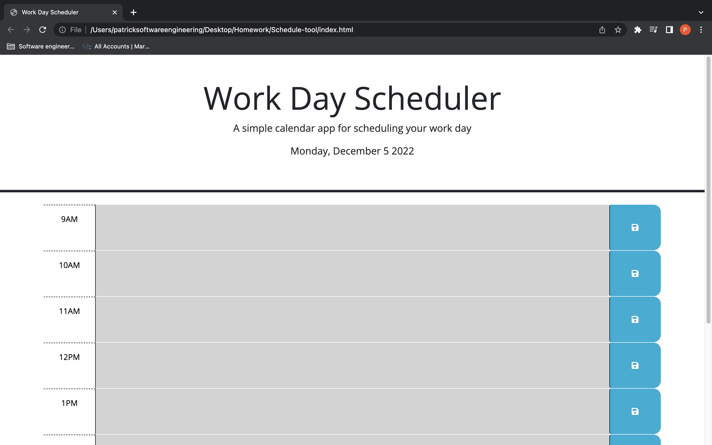

# Scheduling tool

## Description
This is a scheduling tool for workday hours. The application will display the current date, highlight the present box as red, future boxes, as green, and past boxes as grey. The input information will be saved to local storage and displayed when the page is refreshed. 

## Screenshot

## Link to deployed site

[Deployed Page](https://pmorris50.github.io/Schedule-tool//)

## Application
This will help you keep a detailed schedule of your work day and track the time of day.
## Credits 
N/A
## 
Please refer to the LICENSE in the repo.
